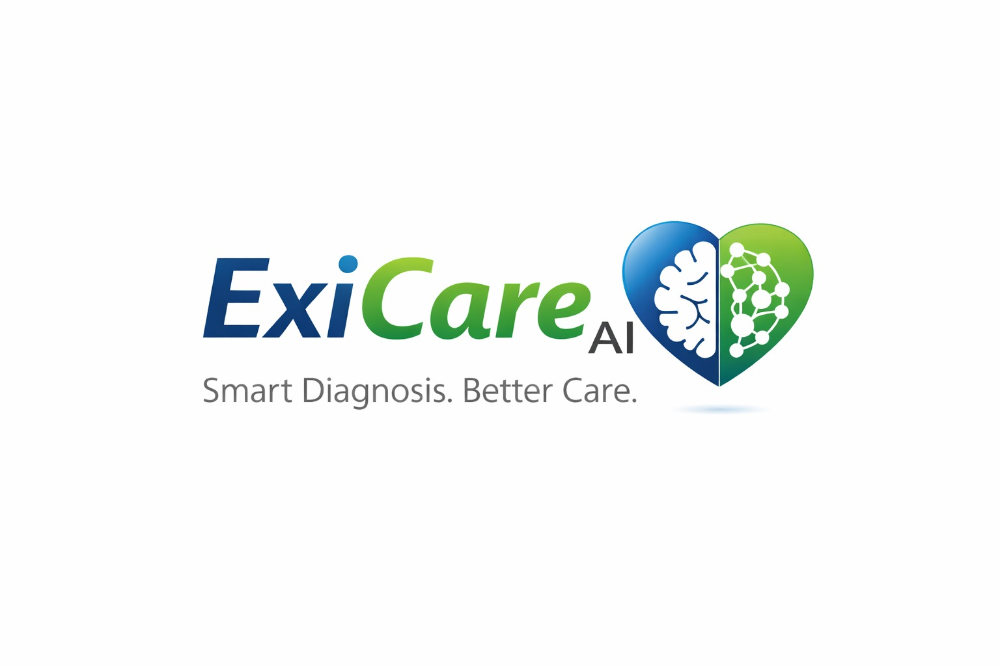
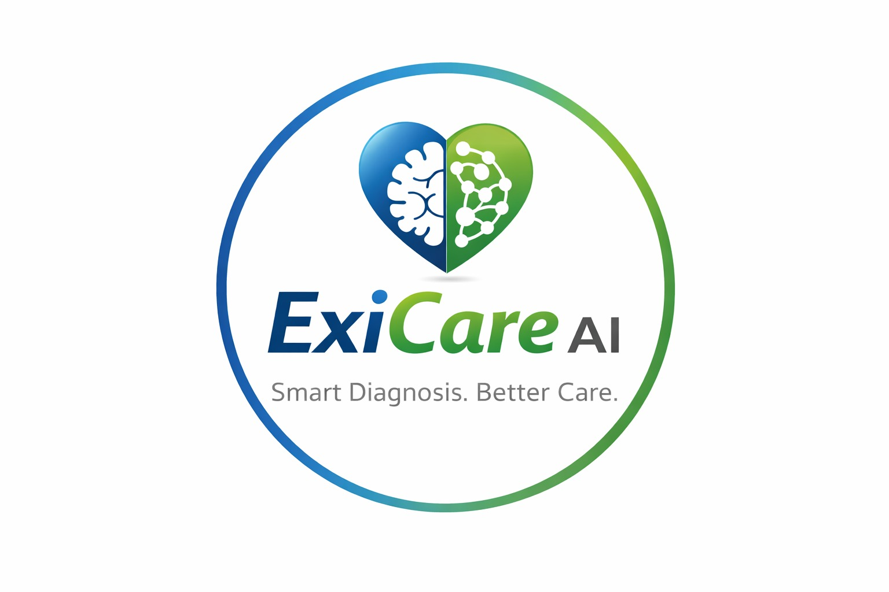

<div align="center">
  
</div>

<br />

<div align="center">
  
  <h1 align="center">AI Clinical Decision Support</h1>
  <h3 align="center">For Symptom-Based Diagnosis</h3>
  <p align="center">
    <strong>Empowering Healthcare Professionals with AI-Driven Diagnostic Insights</strong>
  </p>
</div>

<div align="center">
  
  
  
  
</div>

---

## 📖 Context & Problem Statement
Accurate diagnosis is critical for effective medical treatment. Doctors often rely on their clinical experience to interpret symptoms and medical history, which can be challenging when dealing with complex or overlapping conditions. AI-powered decision support systems can assist healthcare professionals by analyzing patient symptoms and suggesting possible diagnoses.

Hospitals collect large amounts of patient data including symptoms, medical history, and diagnostic test results. By applying Artificial Intelligence and machine learning techniques, these data can be analyzed to identify patterns associated with various diseases. Such systems can help doctors quickly assess possible conditions and improve clinical decision-making.

## 🎯 Objective
Develop an AI-based clinical decision support system that:
1. Accepts patient symptoms and basic medical history as input.
2. Analyzes the data using AI/ML models to suggest possible diagnoses.
3. Provides probability-based insights for different medical conditions.
4. Assists healthcare professionals in making faster and more informed clinical decisions.

## ✨ Features
- **User-friendly Interface:** Streamlit-powered UI for entering patient symptoms (including voice input) and clinical information.
- **AI-based Diagnostic Model:** Leveraging advanced Large Language Models (Groq) and PyTorch embedding models (Sentence-Transformers) for deep semantic understanding of symptoms.
- **Confidence Dashboard:** Displaying potential diagnoses with probability-based confidence levels.
- **EHR Integration Ready:** Designed with the ability to integrate with electronic health records and simulated patient datasets.
- **Report Generation:** Export comprehensive clinical insights directly as PDF reports.

## 🛠️ Technology Stack
- **Frameworks**: Python, Streamlit
- **AI/ML**: PyTorch, Sentence-Transformers, Groq API
- **Data Processing**: Pandas, NumPy
- **Utilities**: SpeechRecognition, ReportLab, Pydantic

## 🚀 Getting Started

### 1. Clone the Repository
```bash
git clone https://github.com/vin109/Medico.git
cd Medico
```

### 2. Install Dependencies
```bash
pip install -r requirements.txt
```

### 3. Setup Environment Variables
Create a `.env` file in the root directory and add your Groq API Key:
```env
GROQ_API_KEY=your_api_key_here
```

### 4. Run the Application
Start the Streamlit application (using the final phase file):
```bash
streamlit run phase4_v2.py
```

## 📂 Deliverables Included
1. **Working Prototype:** Fully functional AI-based diagnostic support system.
2. **Datasets:** Verified medical datasets used for evaluation are provided in the `DATASETS/` folder.
3. **Documentation:** Detailed system architecture and technical workflow can be found in `report.pdf`.

---
<div align="center">
  <i>Developed to enhance clinical workflows and support medical professionals.</i>
</div>
